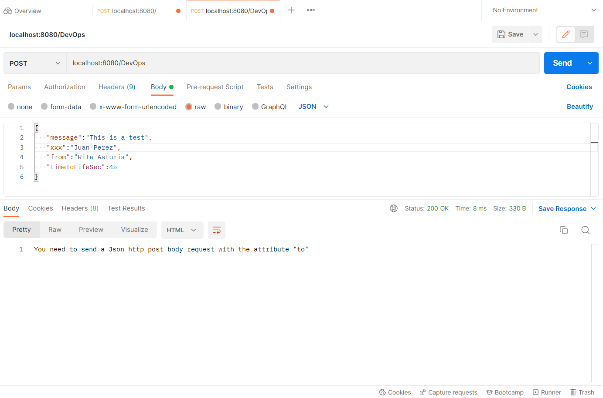

# DevOps
BancoPichincha DevOps Test 

## API REST FEATURES
- BACKEND: NodeJs 
- FRAMEWORK: Express
- AUTHENTICATION: Jason Web Token - JWT
- CONTROL VERSION: GIT
- CONTAINERIZATION: Docker
- CI/CD: Github

## DESCRIPTION 
This is an API Rest developed with NodeJS and Express framework in backend, with Jason Web Token (JWT) authentication. It is to two parts, the first the JWT generation and the second the access to the API.
POST METHOD request is used to both of them buy also it allows the GET method in the first part of the API, but in the second only is 
allowed POST method according to test rules.
This API is configured to be deployed using an image of Docker and test to Continuous integration and Continuous delivering using GitHub 

## NOTE
In the current explanation is used Postman interface like a API test tool, so it is shown some screenshots by each process.

## EXPLANATION
### Part ONE
The home url domain '/' shows you a brief user instructions. Here you need to send the Api key named 'APIKey' with the value assigned by the test rulers through POST Header Http method, as shown in the next figure.


Then you will have an JSON response with some attributes, one is the 'GeneratedToken', you need to copy the jason web token to use the API service in the next part.


### Part two
Go to the subdomain url named '/DevOps' and send the JWT generated in the part one, use POST method with header "GeneratedToken" just it is shown in the following picture.


In addition to the above and according to test rules, you have to send a JSON body POST request with an attribute named "to", to deploy the final response, the format is similar to:

```markdown
{
    “message” : “This is a test”,
    “to”: “Juan Perez”,
    “from”: “Rita Asturia”,
    “timeToLifeSec” : 45
}
```


Finally, if the JWT is right and the time to used is under 5 minutes (this is the limite to time expire), you will get the following JSON response: 
```markdown
{
“message” : “Hello Juan Perez your message will be send”
}
```


If you send a wrong key or jwt value, it shows the following error message

 
Also if the JSON body with the attribute 'to' is not sent, it will deploy the following message.



